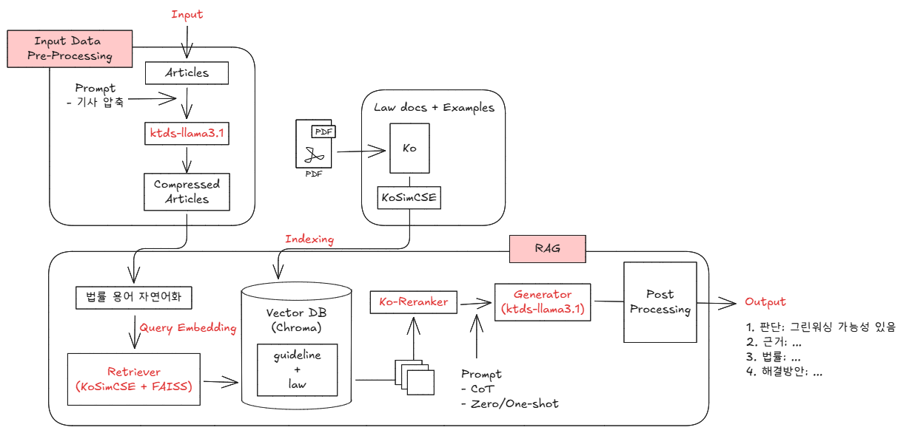

# GreenCheck: RAG 기반 그린워싱 탐지 시스템

한국 환경 규제 기준을 바탕으로 기업의 친환경 마케팅 문구에서 **그린워싱 여부를 자동으로 판단**하고, 관련 **법적 근거와 개선방안**까지 제시하는 RAG(Retrieval-Augmented Generation) 기반 시스템입니다.

---

## 🧩 프로젝트 개요

- **프로젝트명**: GreenCheck
- **목표**: 한국 기업의 마케팅 문구를 입력받아, 환경부/공정위의 가이드라인과 법령을 기준으로 **그린워싱 여부 판단 및 설명 생성**
- **핵심 기능**:
  - 기사/문구 압축 및 전처리
  - 환경 키워드 기반 문장 추출
  - 벡터 검색 + Reranker 기반 관련 법률 검색
  - LLM을 활용한 판단/근거/법률/해결방안 응답 생성

---

## 🛠️ 시스템 아키텍처

1. **입력**: 뉴스 기사 또는 마케팅 문구
2. **전처리**: 문장 압축 및 환경 관련 문장 추출
3. **벡터 검색**: KoSimCSE + Chroma DB (가이드라인, 법령 분리)
4. **Reranker**: Cross-encoder 기반 문서 재정렬
5. **응답 생성**: Llama3Ko 기반 LLM 프롬프트 처리
6. **출력**: 판단 결과, 위배 조항, 법률, 해결 방안



---

## 📚 데이터

- **규제 문서**:
  - 환경부 가이드라인 (친환경 경영활동 표시·광고 가이드라인)
  - 공정거래위원회 가이드라인
  - 7개 이상 국내 환경 관련 법령
- **사례 데이터**:
  - 빠띠 공익데이터 기반 마케팅 문구
  - 네이버 뉴스 기반 친환경 기사 수집
  - 그린워싱 수준: 있음(1.0), 의심(0.5), 없음(0.0)

---

## ⚙️ 실행 방법

### 1️⃣ GitHub에서 코드 다운로드

```bash
git clone https://github.com/shin0112/final-project.git
cd final-project
```

### 2️⃣ 가상환경 및 백엔드 설정

✅ Python 가상환경 (선택)

```bash
python -m venv .venv
# Windows
.venv\Scripts\activate
# macOS/Linux
source .venv/bin/activate
```

✅ Python 라이브러리 설치

```bash
pip install --upgrade pip
pip install -r requirements.txt
```

### 3️⃣ 프론트엔드(npm) 설치

```bash
cd greencheck-ui
npm install
npm audit fix
cd ..
```

### 4️⃣ 환경 변수 설정 (.env 또는 직접 입력)

```dotenv
HUGGINGFACE_TOKEN=your_token_here
GROQ_API_KEY=your_groq_key_here
```

- [HuggingFace 토큰 생성](https://huggingface.co/settings/tokens)
- [Groq API Key 생성](https://groq.com/)

### 5️⃣ 서버 및 프론트 실행

✅ 백엔드 실행

```bash
cd src
uvicorn server.py:app
```

✅ 프론트엔드 실행

```bash
cd greencheck-ui
npm run dev
```

이후 http://localhost:5173 또는 http://localhost:3000에서 접속 가능

프론트엔드에서 문장 입력 후, LLM 분석이 완료되면 다음과 같은 결과를 확인할 수 있습니다:


## ⚙️ 기술 스택

- Python 3.10+
- LangChain, FAISS, Chroma
- Transformers, SentencePiece
- LLM API 또는 로컬 실행 (예: Llama3Ko)
- Seraph GPU 서버 환경 (32GB VRAM)

## 📁 폴더 구조

```text
├── data/
│   └── greenwashing/      # 기사, 라벨링 데이터
├── greencheck-ui/         # ui 화면
├── src/                   # 전체 파이프라인 코드
└── README.md              # 현재 문서
```

## 🧪 실험

- **임베딩 모델**: KoSimCSE
- **LLM 모델**: KoAlpaca, Mistral, Llama3Ko → **최종: Llama3Ko**
- **프롬프트 전략**: zero-shot, one-shot, few-shot, CoT 적용
- **검색 구조 실험**:
  - 단일 검색 vs. 이중 검색 vs. Reranker
  - **Reranker 기반 구조가 가장 안정적인 성능** 보임

---

## 📌 참고사항

- 본 시스템은 연구 목적의 프로토타입으로, 실제 법적 판단으로 사용하기에는 한계가 있습니다.
- 테스트 데이터는 수작업 라벨링을 기반으로 하며, 향후 전문가 리뷰 필요
